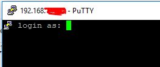
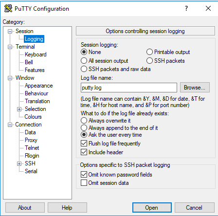
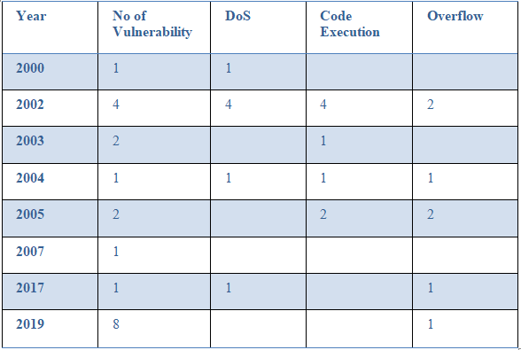
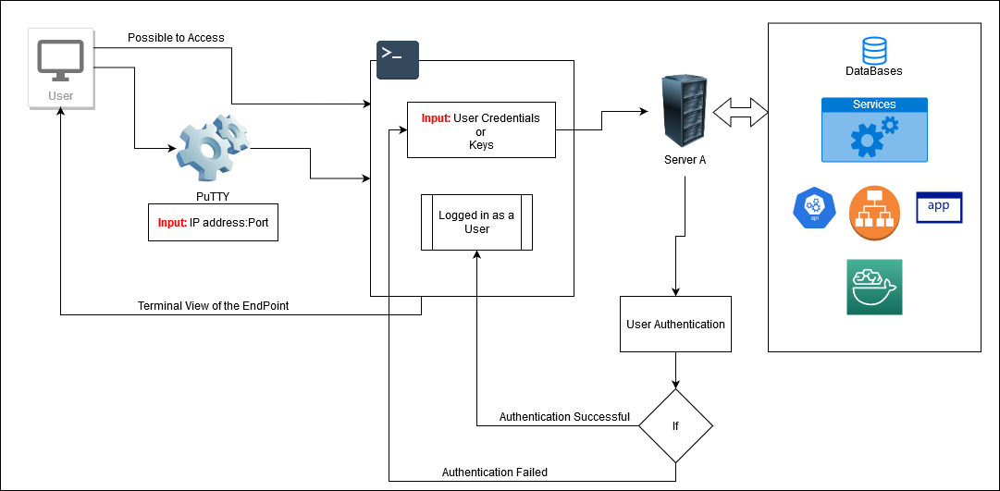
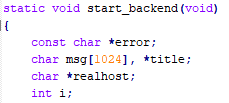

# **Secure Software Engineering**

 **CH 1: Domain &amp; historical Analysis**

**\Overview of the product,**

PuTTY is a free and open-source terminal emulator, serial console and network file transfer application. It supports several network protocols, including SCP, SSH, Telnet, rlogin, and raw socket connection. It can also connect to a serial port. The name &quot;PuTTY&quot; has no official meaning.

PuTTY was originally written for Microsoft Windows, but it has been ported to various other operating systems. Official ports are available for some Unix-like platforms, with work-in-progress ports to Classic Mac OS and macOS, and unofficial ports have been contributed to platforms such as Symbian, Windows Mobile and Windows Phone.

Basically it allows you to connect to a server securely and provides a platform to execute your commands on that server. For example, if you have a Linux server running remotely, you use Putty to access that Linux server from your home securely using a protocol called &quot;SSH&quot; which stands for [SSH (Secure Shell)](https://www.ssh.com/ssh/). Once connected to the server, you can execute commands directly from your own machine regardless of where you are. Obviously, you need your credentials on the Linux server to secure shell access into it.

Some features of PuTTY are:

- [Unicode](https://simple.m.wikipedia.org/wiki/Unicode) support.
- Control over the [SSH](https://simple.m.wikipedia.org/wiki/Secure_Shell) encryption key and protocol version.
- Command-line [SCP](https://simple.m.wikipedia.org/wiki/Secure_copy) and [SFTP](https://simple.m.wikipedia.org/wiki/SSH_file_transfer_protocol) clients, called &quot;pscp&quot; and &quot;psftp&quot; respectively.
- Control over [port forwarding](https://simple.m.wikipedia.org/wiki/Port_forwarding) with SSH (local, remote or dynamic port forwarding), including built-in handling of [X11](https://simple.m.wikipedia.org/wiki/X_Window_System) forwarding.
- Emulates most [xterm](https://simple.m.wikipedia.org/w/index.php?title=Xterm&amp;action=edit&amp;redlink=1), VT102 control sequences, as well as much of [ECMA-48](https://simple.m.wikipedia.org/w/index.php?title=ANSI_escape_code&amp;action=edit&amp;redlink=1)[terminal emulation](https://simple.m.wikipedia.org/w/index.php?title=Terminal_emulator&amp;action=edit&amp;redlink=1).
- [IP Version 6](https://simple.m.wikipedia.org/wiki/Internet_Protocol) support.
- Supports [3DES](https://simple.m.wikipedia.org/wiki/Triple_DES), [AES](https://simple.m.wikipedia.org/wiki/Advanced_Encryption_Standard), [Arcfour](https://simple.m.wikipedia.org/wiki/RC4), [Blowfish](https://simple.m.wikipedia.org/wiki/Blowfish_(cipher)), [DES](https://simple.m.wikipedia.org/wiki/Data_Encryption_Standard).
- [Public-key](https://simple.m.wikipedia.org/wiki/Public-key_cryptography)[authentication](https://simple.m.wikipedia.org/wiki/Authentication) support.
- Support for local [serial port](https://simple.m.wikipedia.org/wiki/Serial_port) connections.

- Latest version: 2019-09-29 PuTTY 0.73 released.

**Vendors of the product,**

PuTTY is maintained by a small team based in Cambridge, England. They handle writing PuTTY, updating its Web site, recording its bugs, and reading (and often responding to) messages to the PuTTY contact e-mail address.

**Simon Tatham**

Project originator, main developer and benevolent dictator. Wrote the majority of the code; does the majority of new development and features. Also maintains [Halibut](https://www.chiark.greenend.org.uk/~sgtatham/halibut/), the documentation system used to produce the Windows Help file and the HTML manual.

Alexandra Lanes

Looks after the nightly snapshot builds, answers mail. Provider of common sense. Programmer, cardboard and sometimes real.

Ben Harris

Did a lot of the early work on the (still unfinished) Macintosh port and is reputed to understand ISO 2022. He&#39;s also the maintainer of an enormous [concordance](https://bjh21.me.uk/all-escapes/all-escapes.txt) of escape sequences and of [NetBSD/acorn26](http://www.netbsd.org/Ports/acorn26/).

Jacob Nevins

Answers mail, herd&#39;s wish list, occasionally writes code.

**Establishment year,**

Initial release **-** January 8, 1999; 21 years ago

[Stable release](https://en.wikipedia.org/wiki/Software_release_life_cycle) - 0.73 / September 29, 2019 months ago

**Programming languages of the product,**

Written in C language, python also used (found in code inspection)

**Purpose of the product,**

Putty (software) generally has two purposes.

1. Used as a File Transfer Protocol.

-\ Most of the hosting services, both online and offline are built on LINUX OS, rightly so because it provides better safety for client data. Especially when thousands of clients data stored in a single place safety is the first priority.

-\ However this poses a greater challenge for non-LINUX OS users to deal with. Here comes the third party applications like PuTTy which enables non-Linux users install this particular software (PuTTy), and interact with Linux servers from a non-Linux OS

-\ Interface of PuTTy is similar to windows terminal, However user need to be aware of Linux commands to interact with it

-\ PuTTy provides various File transfer features like FTP and SFTP depending on user&#39;s security requirements.

2. Used to generate Hash key

-\PuTTy also used to generate SSH keys. Nowadays using passwords are prone to security threats especially when you are dealing with a lot of confidential data online. PuTTy allows you to generate a series of keys. Which is a combination of hundreds of Alphanumeric and special characters, which is almost impossible to crack

-\SSH generates two types of key combinations i.Public key which is used to access the terminal by authorized people, And Private key which should not be shared with anyone, Private Key is encrypted into the particular server of the user which can only be opened with a public key

-\ When you&#39;re using a particular system to access a server you can just point to the public key and you can login to the server any time without entering any password or user nsme

-\One place where i particularly found the use of PuTTy is &quot;Digital Ocean hosting services&quot;

**Current usage of the product,**

As an SSH client on Windows, The SSH protocol was developed as a secure, encrypted replacement for the RSH protocol. RSH is used for remote shell access to a UNIX (or UNIX-like) system and was once popular among sysadmins before network security became the constant concern it is now. Now, thanks to SSH, the same convenience can be had with an encrypted protocol famous for its versatility and strong security. While OpenSSH is probably the most-used implementation of SSH in the world, PuTTY is likely the most-used SSH client for the MS Windows platform.

In a multi-user operating system like [Unix](https://en.wikipedia.org/wiki/Unix), the interface is generally of command-line type, just like the command prompt or MS-DOS. As such the user needs to type in the command in the command line program to get anything processed by the system. Generally, these commands can quickly be run over a network from a different computer on a different location (client) and the response is transferred over the network to the client. The arrangement mentioned above is made possible with the help of network protocols like SSH, Telnet, Rlogin, etc. Interestingly, users can give commands to multiple computers simultaneously.

SSH (Secure Shell) protocol is a cryptographic network protocol that allows you to access an internet server while encrypting any information sent to that server. Some of the other protocols include Telnet, Rlogin only if either you are connected to a UNIX system or you have a login account on a web server (a shell account). [PuTTY](https://en.wikipedia.org/wiki/PuTTY) is one such application that enables this kind of transfer.

# PuTTY supports the following protocols

- SCP (Secure Copy)
- SSH (Secure Shell)
- Telnet
- Rlogin
- Raw socket connection.

# The List of Operating Systems that support PuTTY:

- Windows 95, 98
- Windows ME, NT
- Windows 2000, 2003, 2008
- Windows XP
- Windows Vista
- Mac OSX

**How big is this product?**

PuTTY is currently [beta software](https://simple.m.wikipedia.org/w/index.php?title=Beta_software&amp;action=edit&amp;redlink=1). Licensed under the [MIT License](https://simple.m.wikipedia.org/wiki/MIT_License), and it is [free and open source software](https://simple.m.wikipedia.org/wiki/Free_and_open_source_software). This is categorized as a terminal emulator.

PuTTY is maintained by a small team based in Cambridge, England.

More than 300 files, also there are few python files.

As an Ex:

- Ssh.c - 11852 code lines.

- Sftp.c - 1444 code lines.

- Sshrsa.c - 1078 code lines.

- Psftp.c - 2991 code lines.

- Window.c - 5852 code lines.

**Since PuTTY is an open source tool others can contribute to the project,**

PuTTY is more than just an SSH client. It supports all of the following protocols:

- **raw:** The raw protocol is normally used for network debugging.
- **rlogin:** This is an unencrypted UNIX remote login protocol that uses port 513 by default.
- **serial:** The serial option is used to connect to a serial line. The most common purpose for this is to establish a serial connection between computers in lieu of an Ethernet or other network connection.
- **SSH:** As already noted, SSH is an encrypted secure remote login protocol, which uses port 22 by default.
- **Telnet:** Like rlogin, Telnet (_tel_ecommunication _net_work) is an unencrypted remote login protocol. It typically uses port 23 and is available on many systems other than UNIX. Like rlogin, Telnet has waned in popularity due to privacy concerns.

In addition to the five protocols supported by PuTTY, it also supports features such as saved session configurations, session logging, locale (language) settings, and proxy sessions.

**\\Overview of findings**

**How good this tool based on,**

Mainly this particular tool is used to get remote access into the servers and PCs in the network. By using IP address and ports or else IP address and connection type users can access into the endpoint. 

After this phase it will prompt the terminal to log into the relevant device. User needs to input credentials to connect. 

**Confidentiality** : This is really protected because of the login. There is specific login to the relevant device. But if there is no specific login is a huge problem because those servers or PCs can store confidential details. All the data sent under the encryption mechanism.

**Integrity** : When a user is using putty, if there are any access key changes or other changes of the login details, integrity will be failed. This can be a huge problem to the legitimate users. Because some third party user has changed the integrity of logins or tried to pretend as a legitimate user.

**Availability** : Putty can affect DoS attacks because of the buffer overflow. In C language buffer overflow is the common problem. So attackers can use overflow as a DoS attack. Whenever DoS attacks happen, availability is going down. So legitimate users can&#39;t get into the endpoint by using putty or any SSH client.

**Authentication** : Putty always needs authentication which is found to legitimate users. All the logins which are used at the end point are needed to authenticate users. And also if there are any security questions before login into the system that also show on the terminal screen as well. As well as key based authentications are possible with this application.

**Authorization** : When we login into the system, the user needs to select the correct user (privileged or unprivileged user). As well as if there is any key based authentication to checkout privileges of the user or given permissions of the user, it is possible to do with this application.

**Accountability** : There is an option for creating logs of the current session in Putty. Also users can have access to that saved log again and check session details.

**Vulnerabilities,**

All the vulnerabilities in the above table are fixed.

**Going to address 4 vulnerabilities:**

**01)** [**CVE-2004-1008**](https://www.cvedetails.com/cve/CVE-2004-1008/)

Severity Level: **Critical**

Discovered in: 10/27/2004

Presented: 10/29/2004 by Unknown with iDEFENSE

Nessus identified as: (plugin ID 15581) GLSA-200410-29: PuTTY: Pre-authentication buffer overflow

This vulnerability has been found in the Putty version up to 0.55. This is affecting unknown processing of the component Ipv6 Handler. Performing ssh action (SSH2\_MSG\_DEBUG) with the unknown end can be the memory corruption vulnerability. This will have a huge impact on confidentiality, integrity, and availability.

The attack can be started remotely. To this attack no form of authentication to be successful. All the technical details as well as exploits are known.

By updating into the Putty version 0.56 can eliminate this vulnerability. Also there is a bugfix in the unfix.org. But the best way to mitigate this is patch updating.

**02)** [**CVE-2002-1360**](https://www.cvedetails.com/cve/CVE-2002-1360/)

Severity Level: **Critical**

Discovered in: 12/23/2202

Presented: unknown

Nessus identified as: (plugin ID 48968) SSH Malformed Packet Vulnerabilities - Cisco Systems

This vulnerability was found in Putty version 0.48/ 0.49/ 0.53. An unknown part of the component NULL Character Handler will be affected with this vulnerability. This also to be corrupting memory with the unknown inputs. This vulnerability highly affects confidentiality, integrity and availability.

Most of the SSH2 servers and clients don&#39;t properly handle strings which hold null characters when the string length is specified. This will be helpful for the attackers to perform denial of service attack or else execute arbitrary code using null-terminated strings in C language.

This attack also can initiate remotely. This attack happens with no form of authentication and gains access with the administrative privileges. The technical details as well as the exploit is not available. Applying security patches is the best solution to mitigate this vulnerability as well.

**03)** [**CVE-2019-17067**](https://www.cvedetails.com/cve/CVE-2019-17067/)

Severity Level: **Medium**

Discovered in: 10/01/2019

Presented: unknown

This vulnerability is found in Putty versions up to 0.72 which are used on Windows OS. This is affected by unknown functionality of the component Port-Forwarding. This leads to privilege escalation vulnerability with the unknown inputs. This attack needs local access to approach and needs a single authentication for the exploitation. Technical details are unknown and exploitation is not available.

Best way to mitigate this is upgrading the putty version into the version 0.73. This will eliminate this vulnerability.

**04)** [**CVE-2019-9898**](https://www.cvedetails.com/cve/CVE-2019-9898/)

Severity Level: **Medium**

Discovered in: 03/20/2019

Presented: unknown

This vulnerability was found in the Putty version up to 0.70. This will affect some unknown processing&#39;s of the component Random Number Generator. This leads to a weak encryption vulnerability. This also impacts confidentiality, integrity and availability.

This exploitation is hard to identify and also this will initiate remotely. As well as no form of authentication for successful exploitation. About the technical details and exploitations are not in publically available.

The best way to mitigate this is upgrading putty to version 0.71. This will eliminate this vulnerability.

**\\Product Asset,**

**Internal Libraries,**

Using standard C libraries.

#include \<stdio.h\>

#include \<stdlib.h\>

#include \<stdarg.h\>

#include \<assert.h\?

#include \<limits.h\>

These are used to manipulate inputs/outputs, as well as to get common functions which are using in the C language, such as &quot;strcpy()&quot;.

**External libraries,**

Used customized libraries.

#include <putty.h>

#include <psftp.h>

#include <storage.h>

#include <ssh.h>

#include <sftp.h>

#include <int64.h>

These libraries are used to manipulate connections between computers or servers.

**No API calls, 3 ****rd**  **party utilities,**  **Email configuration, Audio, Video, Image**

**User sensitive data** : using credentials in terminal view. Only can show username and password is not visible.

**Browser history** → no browsing history recorded

**Extensions** → for windows client using .exe extension

**How to handle security test cases** (if have) → no any

**Sandbox** → this tool is not a sandbox but it can make a connection into the shell based sandbox.

**\\Example attack**

In larger scale organizations, there are more than 10000 SSH keys.

For example, in one typical financial institution we found 3 million SSH keys granting access to 15,000 servers. That is an average of 200 keys per server.

Some attackers break into one server and gain access for root privilege users. And find private keys which are used by privileged users. And spread malicious tasks as they want. To break into the system they can use vulnerabilities in the Putty like buffer overflow or else remote code execution.

 **CH: 2 Design Analysis**

**\\Architecture Overview**

 

Putty is used to make remote connections to servers or else PCs in the network. It is a SSH client for the user&#39;s Windows machine.

**PuTTY consists of several functionalities,**

- PuTTY: the [Telnet](https://en.wikipedia.org/wiki/Telnet), [rlogin](https://en.wikipedia.org/wiki/Rlogin), and [SSH](https://en.wikipedia.org/wiki/Secure_Shell) client itself, which can also connect to a [serial port](https://en.wikipedia.org/wiki/Serial_port)
- PSCP: an [SCP](https://en.wikipedia.org/wiki/Secure_copy) client, i.e. command-line secure file copy. Can also use [SFTP](https://en.wikipedia.org/wiki/SSH_File_Transfer_Protocol) to perform transfers
- PSFTP: an [SFTP](https://en.wikipedia.org/wiki/SSH_File_Transfer_Protocol) client, i.e. general file transfer sessions much like [FTP](https://en.wikipedia.org/wiki/File_Transfer_Protocol)
- PuTTYtel: a Telnet-only client
- Plink: a command-line interface to the PuTTY back ends. Usually used for [SSH Tunneling](https://en.wikipedia.org/wiki/Tunneling_protocol#SSH)
- Pageant: an [SSH authentication agent](https://en.wikipedia.org/wiki/Ssh-agent) for PuTTY, PSCP and Plink
- PuTTYgen: an [RSA](https://en.wikipedia.org/wiki/RSA_(algorithm)), [DSA](https://en.wikipedia.org/wiki/Digital_Signature_Algorithm), [ECDSA](https://en.wikipedia.org/wiki/Elliptic_Curve_Digital_Signature_Algorithm) and [EdDSA](https://en.wikipedia.org/wiki/EdDSA) key generation utility
- pterm: (Unix version only) an X11 client which supports the same terminal emulation as PuTTY

Also PuTTY&#39;s terminal emulation is very highly featured, and can do a lot of things under remote server control. Some of these features can cause problems due to buggy or strangely configured server applications.

The Features configuration panel allows you to disable some of PuTTY&#39;s more advanced terminal features, in case they cause trouble.

**Disabling application keypad and cursor keys:**

Application keypad mode and application cursor keys mode alter the behavior of the keypad and cursor keys. Some applications enable these modes but then do not deal correctly with the modified keys. Force these modes to be permanently disabled no matter what the server tries to do.

**Disabling xterm-style mouse reporting:**

PuTTY allows the server to send control codes that let it take over the mouse and use it for purposes other than copy and paste. Applications which use this feature include the text-mode web browser links, the Usenet newsreader trn version 4, and the file manager mc (Midnight Commander).

If you find this feature inconvenient, you can disable it using the &quot;Disable xterm-style mouse reporting&quot; control. With this box ticked, the mouse will _always_ do copy and paste in the normal way.

Note that even if the application takes over the mouse, you can still manage PuTTY&#39;s copy and paste by holding down the Shift key while you select and paste, unless you have deliberately turned this feature off.

**Disabling remote terminal resizing:**

PuTTY has the ability to change the terminal&#39;s size and position in response to commands from the server. If you find PuTTY is doing this unexpectedly or inconveniently, you can tell PuTTY not to respond to those server commands.

**Disabling switching to the alternate screen:**

Many terminals, including PuTTY, support an &quot;alternate screen&quot;. This is the same size as the ordinary terminal screen, but separate. Typically a screen-based program such as a text editor might switch the terminal to the alternate screen before starting up. Then at the end of the run, it switches back to the primary screen, and you see the screen contents just as they were before starting the editor.

Some people prefer this not to happen. If you want your editor to run on the same screen as the rest of your terminal activity, you can disable the alternate screen feature completely.

**Disabling remote window title changing:**

PuTTY has the ability to change the window title in response to commands from the server. If you find PuTTY is doing this unexpectedly or inconveniently, you can tell PuTTY not to respond to those server commands.

**Disabling destructive backspace:**

Normally, when PuTTY receives character 127 (^?) from the server, it will perform a &quot;destructive backspace&quot;: move the cursor one space left and delete the character under it. This can apparently cause problems in some applications, so PuTTY provides the ability to configure character 127 to perform a normal backspace (without deleting a character) instead.

**Disabling remote character set configuration:**

PuTTY has the ability to change its character set configuration in response to commands from the server. Some programs send these commands unexpectedly or inconveniently. In particular, BitchX (an IRC client) seems to have a habit of reconfiguring the character set to something other than the user intended.

If you find that accented characters are not showing up the way you expect them to, particularly if you&#39;re running BitchX, you could try disabling the remote character set configuration commands.

**Input Output handling,**

All the inputs and outputs are exchanged with the secure network condition. All the details will be encrypted using their own mechanisms.

**How this consider basic level security,**

Putty is a free open source customer application generally used to interface with SSH servers, for example, firewalls and different machines. Putty is signed into the servers or different applications by utilizing SSH. It is an application layer convention and can move records safely also. To give solid security SSH utilizes encryption, authentication and integrity. SSH is the safe substitution to Telnet and FTP when utilizing the SCP. The issue with both Telnet and FTP are, both utilize clear content and don&#39;t give any legitimacy.

**\\Threat model**

Threat model Diagram:

**Misuse cases or abuse separated storage,**

There are no separate storages. This will be given only access to the terminal of the endpoint. But users can have access to the endpoint&#39;s storage according to the user privileges.

**Customized configuration,**

Users can customize configurations of the Putty. Because there are a lot of configurations given. So users can pick their own options and make secure conditions by themselves.

**Security concept (least access privilege),**

All the access privileges are given or selected by the users. Because this is prompting logins which are created inside the endpoint. So users have to choose what they want. Then there is not any issue with the access privileges on the putty side. And also users can select their SSH method as key based or something else.

**I/O handling,**

All the inputs and outputs are exchanged with the secure network condition. All the details will be encrypted using their own mechanisms. And also they are using their own libraries to do that and they have special mechanisms implemented to decrypt details on the server side.

 **CH 03: Code Inspection**

Putty is written in the C language. But also there are few python files. The latest Putty versions are using the most secure coding methods. But in earlier versions there were a lot of bugs as well as vulnerable code sections. Most of them are due to the attacks which are performed on Putty. There are few files which are special for Windows operating systems. In this section we are considering those windows specific files because according to the developers all the functions which are related on windows side are already moved to that part.

**Selected File:: window.c**

In this &quot;start\_backend()&quot; method they are using a fixed size character array called &quot;msg[1024]&quot;. This will be a problem because the array size is fixed. For fixed arrays can be overflow in the C language. And also some attackers can inject remote code which is doing malicious tasks into this kind of variables or arrays. This can be vulnerable to buffer overflow attack as well as remote code execution attack.

Buffer overflow and remote code execution attacks were in this application history. In 2002, 2004, 2005, 2017 and 2019 attacks are examples. Attackers have used [CVE-2019-9895](https://www.cvedetails.com/cve/CVE-2019-9895/)(Medium), [CVE-2017-6542](https://www.cvedetails.com/cve/CVE-2017-6542/)(Medium), [CVE-2005-0467](https://www.cvedetails.com/cve/CVE-2005-0467/)(Medium), [CVE-2004-1440](https://www.cvedetails.com/cve/CVE-2004-1440/)(Medium) , [CVE-2004-1008](https://www.cvedetails.com/cve/CVE-2004-1008/)(High), [CVE-2002-1359](https://www.cvedetails.com/cve/CVE-2002-1359/)(High), [CVE-2002-1357](https://www.cvedetails.com/cve/CVE-2002-1357/)(High) vulnerabilities to exploit the systems.

To mitigate this developer can use dynamic sized arrays.

If our memory block is full, we can double the size of that memory block by calling realloc which simply expands the current memory block.

Ex:-

void push(int \*arr, int index, int value, int \*size, int \*capacity){

if(\*size \ \*capacity){

realloc(arr, sizeof(arr) \* 2);

\*capacity = sizeof(arr) \* 2;

}

arr[index] = value;

\*size = \*size + 1;

}

In the &quot;request\_paste()&quot; method there is a created function but its return value is not used anywhere in the program.

This &quot;CreateThread()&quot; is a returning value which is not used. This is one of the bad practices from the developer. If we are not using that relevant value, not returning is the best practice.

In &quot;write\_aclip()&quot; method, there is a mismatching argument type in the print statement. That is also a bad practice and in some cases this can cause an attack as well(but not guaranteed).

In here &quot;blen &quot; variable is %d in format string requires &#39;int&#39; but the argument type is &#39;signed wchar\_t&#39;. [invalidPrintfArgType\_sint].

And also in this function there is a memory leak in the code segment.

In here clipdata will leak on that return statement. So this is a code error. To fix this we can handle that return values with some useful functions.

**Selected File:: winhandl.c**

In &quot;struct handle \*handle\_input\_new()&quot; there is a created thread which is mentioned below.

This method will return some value but it is not used inside the whole file and not even stored in a variable. This is bad practice. Best practice is using that value to get useful action. At Least developers should store this value in the variable. It will be better to ignore this return value.

In &quot;DWORD WINAPI handle\_input\_threadfunc()&quot; , there is a variable which is not initialized. This is bad practice and also it will generate errors in the compiling time.

&quot;oev&quot; variable which is in this while loop is not initialized. This should be initialized. Otherwise someone can use this variable for other purposes.

**Selected File:: ssh.c**

One of the main files in the whole system and this is common for any platform.

In &quot;ssh\_special()&quot; there is a condition which is always true. That will be a problem because there is no handled state for the else part. So developers should handle it. Otherwise someone can manually add another part to perform some malicious task(There are no such cases like that. But this can happen if someone thinks differently) . Code is mentioned below.

This code segment hasn&#39;t any else part and also it is always true.

In &quot;ssh2\_pkt\_getbool()&quot;, either the condition &#39;if(pktin)&#39; is redundant or there is possible null pointer dereference: pkt. [nullPointerRedundantCheck]. This difference invariably results in the failure of the process.

This can cause &quot;Miscalculated null termination&quot; and &quot;State synchronization error&quot;. This can be controlled, if all pointers that could have been modified are sanity-checked previous to use, can cause to prevent these kinds of vulnerabilities.

**Selected File:: psftp.c**

This file is used as Putty SFTP client, which is transferring files in between computers securely by using SSH connection. So this is another important file inside the Putty source.

In &quot;sftp\_cmd\_cd()&quot;, Either the condition &#39;!dir&#39; is redundant or there is a possible null pointer dereference: dir. [nullPointerRedundantCheck].

This can cause &quot;Miscalculated null termination&quot; and &quot;State synchronization error&quot;. This can be controlled, if all pointers that could have been modified are sanity-checked previous to use, can cause to prevent these kinds of vulnerabilities.

And also in here they using &quot;printf()&quot;. This function is used to print values. But the case is this function will give an output for fixed size buffers. That will be the case for buffer overflow. Mitigation for this is using &quot;dupprintf()&quot; , which is dynamically allocate buffers of the right size of the strings.

 **Summary**

PuTTY is a terminal emulator. A Terminal emulator is a software program, also referred to as a terminal application (in short TTY). PuTTY is an open source emulator and it&#39;s free. The terminal emulator basically emulates, within display architecture, a video terminal. PuTTY is an application which is used for Telnet, SSH, client, and raw TCP and rlogin protocols. It is also used as a &quot;serial console&quot; client. TTY stands for Teletype. Originally PuTTY was developed for Microsoft Windows, but it is now being used for other operating systems. Some official ports available are for UNIX like systems, Mac OS, Mac OSX. Some unofficial ports available are for Symbian and platforms like Windows Mobile.

PuTTY is currently a beta software. Licensed under the MIT License, and it is free and open source software. This is categorized as a terminal emulator. This was maintained and was written by Simon Tatham, maintained by a small team based in Cambridge, England. Latest version released on 2019-09-29 PuTTY 0.73. Initial establishment happened in January 8, 1999, 21 years ago, which written by c language also contains more than 300 files. Used as a File Transfer Protocol and also used to generate hash key. PuTTY is more than just an SSH client. It supports rlogin, serial, SSH, Telnet, raw protocols. In addition to the five protocols supported by PuTTY, it also supports features such as saved session configurations, session logging, locale (language) settings, and proxy sessions.

Mainly this particular tool is used to get remote access into the servers and PCs in the network. By using IP address and ports or else IP address and connection type users can access into the endpoint. So when it comes to security 6 components confidentiality, integrity, availability, authentication, authorization, and accountability protect by this system.

